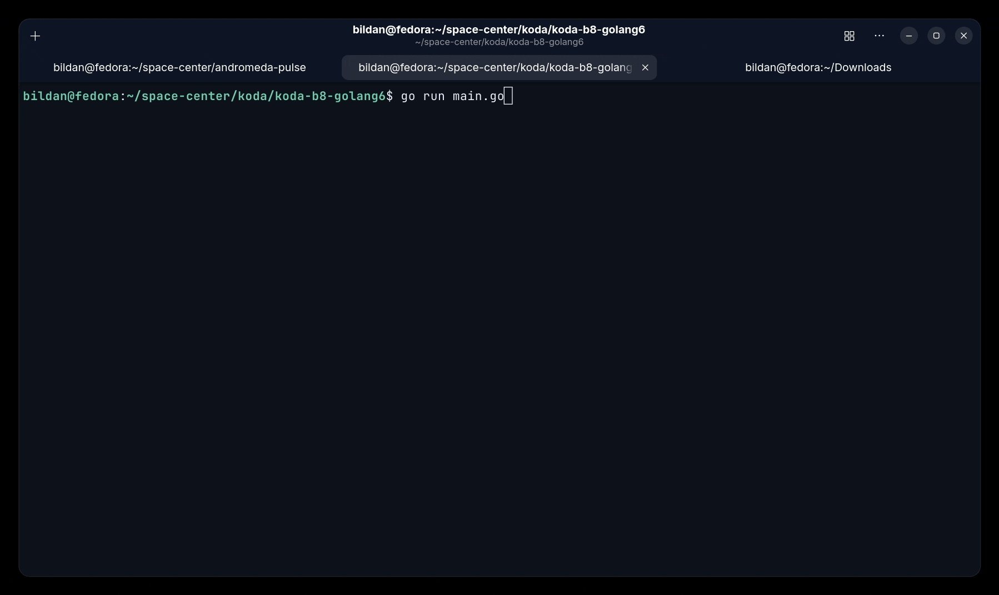

# Program List Pesanan

Program ini mengimplementasikan concurrency, package ```sync.Mutex``` dan menggunakan goroutine untuk function print pesanan berdasarkan waktu tunggunya.

### Tech Stack
- Go v1.26.x


### Preview demo:

